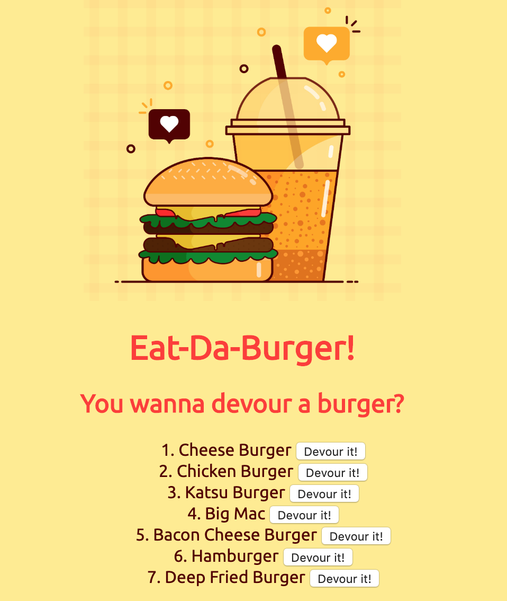
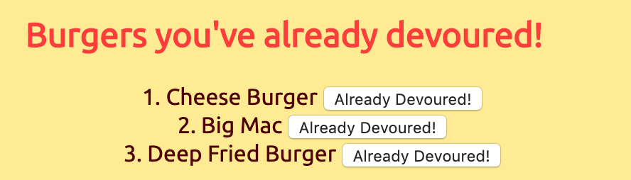
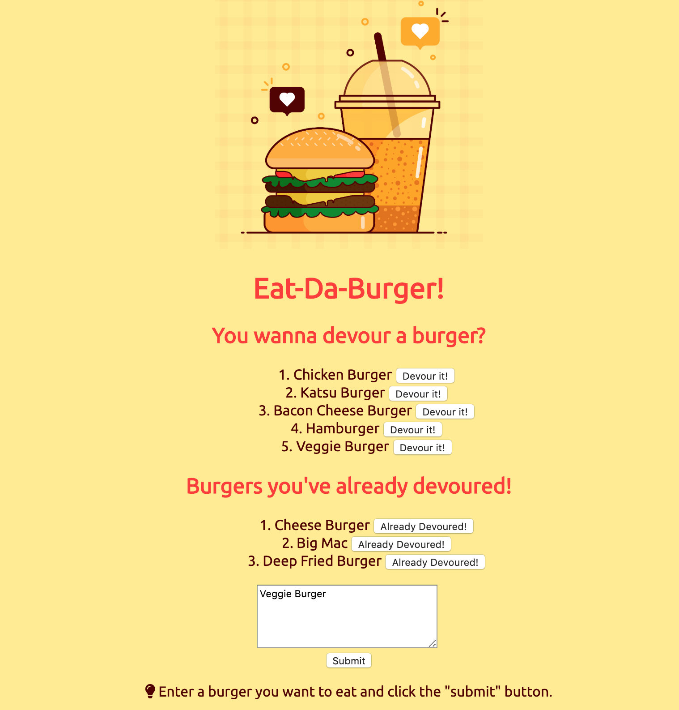

# Eat-Da-Burger!
## What is Eat-Da-Burger! ?
Eat-Da-Burger! is a restaurant app that lets users input the names of burgers they'd like to eat. Whenever a user submits a burger's name, the app will display the burger on the top section of the page -- waiting to be devoured. Each burger in the waiting area also has a `Devour it!` button. When the user clicks it, the burger will move to the bottom section of the page. The app will store every burger in a database, whether devoured or not.

### How to use Eat-Da-Burger! ?
On the homepage, users will see our logo, brand name, and a top section of our "menu". The "menu" section prompts with a question -- "You wanna devour a burger?". In this section, it will display every burger that has been stored in our database. 

When users click on the button 'Devour it!', the burger will be moved to the below section with the header of `"Burgers you've already devoured!"`. 

Finally, users can enter a burger that they want to eat but not found in the "menu" section and click submit. And then the burger will show up in the "menu" section waiting to be devoured.  

